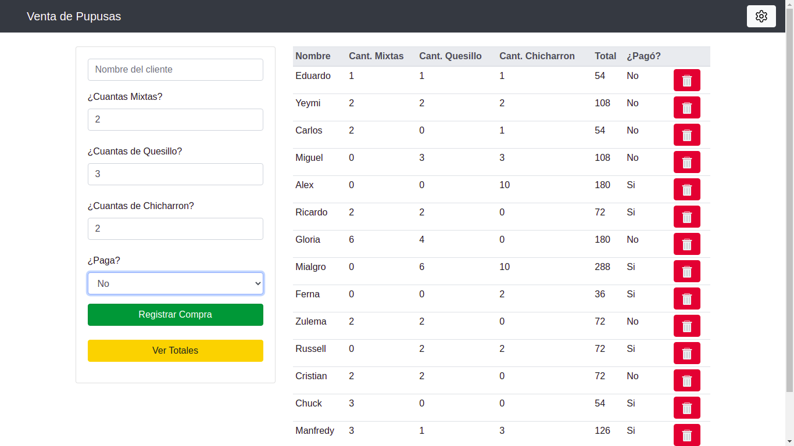
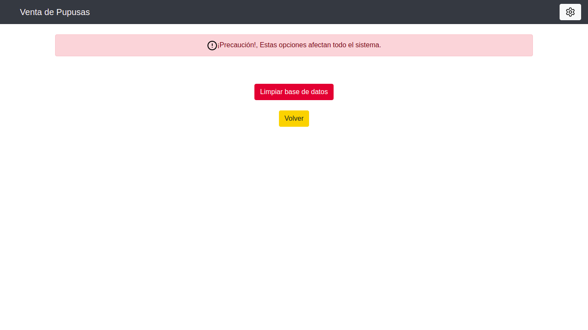
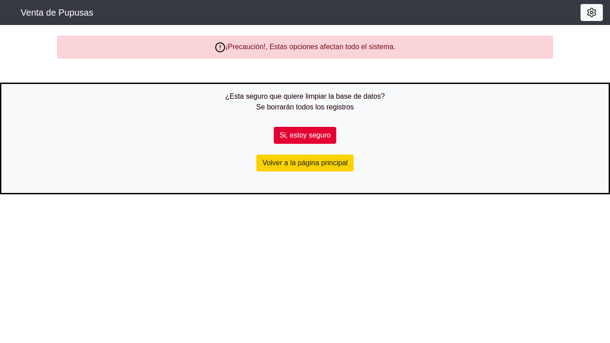
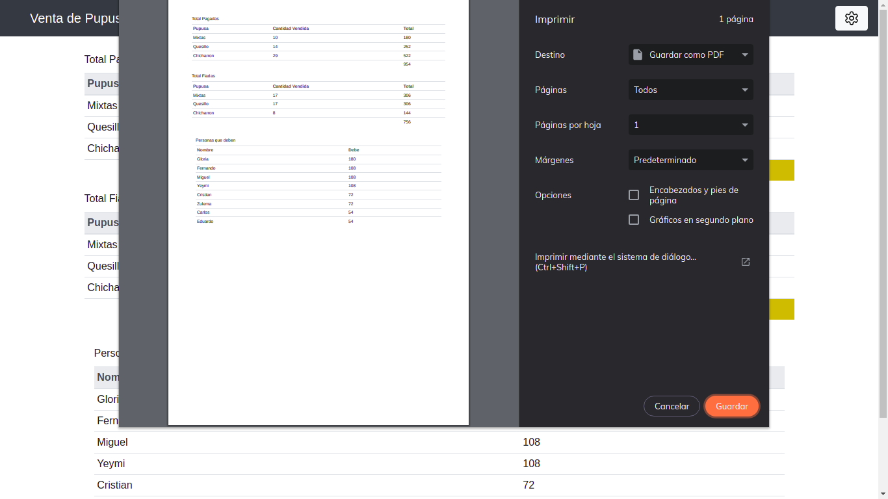

# IBF_MiniSalesSystem
This is a very specific mini sales system for a church in my town

One day per month a local church do a pupusas sales,
they register everything on paper and at the end of 
the sale they manually count how much pupusas they selled,
they sell 3 type of pupusas and they want to know how much
they selled per type and how much money they won per type.

This miniproject have the goal of bring a solution to this situation,
in this way they do not have to count manually everything.

------------------------------------------------------------------------

Un día al mes, una iglesia local hace una venta de pupusas, 
registran todo en papel y al final de la venta cuentan manualmente 
la cantidad de pupusas que vendieron, venden 3 tipos de pupusas y 
quieren saber cuánto vendieron por tipo y cuánto dinero ganaron por tipo.

Este miniproyecto tiene el objetivo de aportar una solución a esta situación, 
de esta forma no tienen que contar todo manualmente.

------

**Screenshots**

**Página Principal**

**Opciones**

**Generar Reporte**

